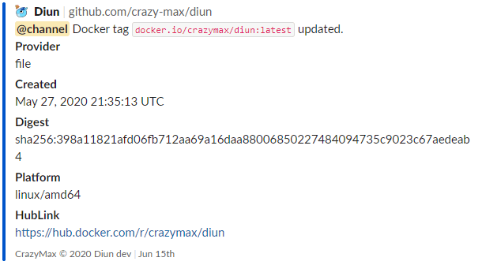

  
  
  
  
  
  
   
  
  
  

## About

**Diun** is a CLI application written in [Go](https://golang.org/)  and delivered as a
[single executable](https://github.com/crazy-max/diun/releases/latest) (and a
[Docker image](https://hub.docker.com/r/crazymax/diun/)) to receive notifications when a Docker image is updated on
a Docker registry.

## Documentation

Documentation can be found on https://crazymax.dev/diun/

## Contributing

Want to contribute? Awesome! The most basic way to show your support is to star the project, or to raise issues. If
you want to open a pull request, please read the [contributing guidelines](.github/CONTRIBUTING.md).

You can also support this project by [**becoming a sponsor on GitHub**](https://github.com/sponsors/crazy-max) or by
making a [Paypal donation](https://www.paypal.me/crazyws) to ensure this journey continues indefinitely!

Thanks again for your support, it is much appreciated! :pray:

## License

MIT. See `LICENSE` for more details.
