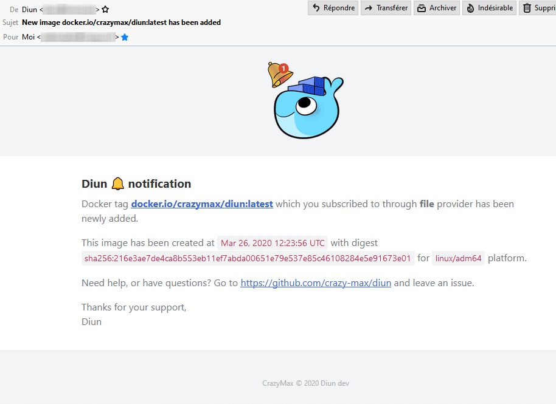

<p align="center"><a href="https://github.com/crazy-max/diun" target="_blank"></a></p>

<p align="center">
  <a href="https://github.com/crazy-max/diun/releases/latest"></a>
  <a href="https://github.com/crazy-max/diun/releases/latest"></a>
  <a href="https://travis-ci.com/crazy-max/diun"></a>
  <a href="https://hub.docker.com/r/crazymax/diun/"></a>
  <a href="https://hub.docker.com/r/crazymax/diun/"></a>
  <a href="https://hub.docker.com/r/crazymax/diun/"></a>
  <br /><a href="https://quay.io/repository/crazymax/diun"></a>
  <a href="https://goreportcard.com/report/github.com/crazy-max/diun"></a>
  <a href="https://www.codacy.com/app/crazy-max/diun"></a>
  <a href="https://www.paypal.com/cgi-bin/webscr?cmd=_s-xclick&hosted_button_id=X2NYRW7D9KL4E"></a>
</p>

## About

**Diun** :bell: is a CLI application written in [Go](https://golang.org/) to  receive notifications :inbox_tray: when a Docker :whale: image is updated on a Docker registry. With Go, this app can be used across many platforms :game_die: and architectures. This support includes Linux, FreeBSD, macOS and Windows on architectures like amd64, i386, ARM and others.

## Features

* Allow to watch a full Docker repository and report new tags
* Include and exclude filters with regular expression for tags
* Internal cron implementation through go routines
* Worker pool to parallelize analyses
* Allow overriding os and architecture when watching
* Beautiful email report
* Webhook notification
* Enhanced logging
* Timezone can be changed
* :whale: Official [Docker image available](#docker)

## Download

Diun binaries are available in [releases](https://github.com/crazy-max/diun/releases) page.

Choose the archive matching the destination platform and extract diun:

```
$ cd /opt
$ wget -qO- https://github.com/crazy-max/diun/releases/download/v0.4.1/diun_0.4.1_linux_x86_64.tar.gz | tar -zxvf - diun
```

After getting the binary, it can be tested with `./diun --help` or moved to a permanent location.

```
$ ./diun --help
usage: diun --config=CONFIG [<flags>]

Docker image update notifier. More info on https://github.com/crazy-max/diun

Flags:
  --help              Show context-sensitive help (also try --help-long and
                      --help-man).
  --config=CONFIG     Diun configuration file.
  --timezone="UTC"    Timezone assigned to Diun.
  --log-level="info"  Set log level.
  --log-json          Enable JSON logging output.
  --run-startup       Run on startup.
  --docker            Enable Docker mode.
  --version           Show application version.
```

## Usage

`diun --config=CONFIG [<flags>]`

* `--help` : Show help text and exit. _Optional_.
* `--version` : Show version and exit. _Optional_.
* `--config <path>` : Diun YAML configuration file. **Required**. (example: `diun.yml`).
* `--timezone <timezone>` : Timezone assigned to Diun. _Optional_. (default: `UTC`).
* `--log-level <level>` : Log level output. _Optional_. (default: `info`).
* `--log-json` : Enable JSON logging output. _Optional_. (default: `false`).
* `--run-startup` : Run on startup. _Optional_. (default: `false`).

## Configuration

Before running Diun, you must create your first configuration file. Here is a YAML structure example :

```yml
db:
  path: diun.db

watch:
  workers: 10
  schedule: 0 0 * * * *
  os: linux
  arch: amd64

notif:
  mail:
    enable: false
    host: localhost
    port: 25
    ssl: false
    insecure_skip_verify: false
    username:
    password:
    from:
    to:
  webhook:
    enable: false
    endpoint: http://webhook.foo.com/sd54qad89azd5a
    method: GET
    headers:
      Content-Type: application/json
      Authorization: Token123456
    timeout: 10

registries:
  someregistryoptions:
    username: foo
    password: bar
    timeout: 20
  onemore:
    username: foo2
    password: bar2
    insecure_tls: true

items:
  # Watch latest tag of crazymax/nextcloud image on docker.io (DockerHub) with registry ID 'someregistryoptions'.
  -
    image: docker.io/crazymax/nextcloud:latest
    registry_id: someregistryoptions
  # Watch 4.0.0 tag of jfrog/artifactory-oss image on frog-docker-reg2.bintray.io (Bintray) with registry ID 'onemore'.
  -
    image: jfrog-docker-reg2.bintray.io/jfrog/artifactory-oss:4.0.0
    registry_id: onemore
  # Watch coreos/hyperkube image on quay.io (Quay). Assume latest tag.
  -
    image: quay.io/coreos/hyperkube
  # Watch crazymax/swarm-cronjob image and assume docker.io regsitry and latest tag.
  # Only include tags matching regexp ^1\.2\..*
  -
    image: crazymax/swarm-cronjob
    watch_repo: true
    include_tags:
      - ^1\.2\..*
  # Watch portainer/portainer image on docker.io (DockerHub) and assume latest tag
  # Only watch latest 10 tags and include tags matching regexp ^(0|[1-9]\d*)\..*
  -
    image: docker.io/portainer/portainer
    watch_repo: true
    max_tags: 10
    include_tags:
      - ^(0|[1-9]\d*)\..*
```

* `db`
  * `path`: Path to Bolt database file where images manifests are stored. Flag `--docker` force this path to `/data/diun.db` (default: `diun.db`).
* `watch`
  * `workers`: Maximum number of workers that will execute tasks concurrently. _Optional_. (default: `10`).
  * `schedule`: [CRON expression](https://godoc.org/github.com/crazy-max/cron#hdr-CRON_Expression_Format) to schedule Diun watcher. _Optional_. (default: `0 0 * * * *`).
  * `os`: OS to use for choosing images. _Optional_. (default: `linux`).
  * `arch`: Architecture to use for choosing images. _Optional_. (default: `amd64`).
* `notif`
  * `mail`
    * `enable`: Enable email reports (default: `false`).
    * `host`: SMTP server host (default: `localhost`). **required**
    * `port`: SMTP server port (default: `25`). **required**
    * `ssl`: SSL defines whether an SSL connection is used. Should be false in most cases since the auth mechanism should use STARTTLS (default: `false`).
    * `insecure_skip_verify`: Controls whether a client verifies the server's certificate chain and host name (default: `false`).
    * `username`: SMTP username.
    * `password`: SMTP password.
    * `from`: Sender email address. **required**
    * `to`: Recipient email address. **required**
  * `webhook`
    * `enable`: Enable webhook notification (default: `false`).
    * `endpoint`: URL of the HTTP request. **required**
    * `method`: HTTP method (default: `GET`). **required**
    * `headers`: Map of additional headers to be sent.
    * `timeout`: Timeout specifies a time limit for the request to be made. (default: `10`).
* `registries`: Map of registry options to use with items. Key is the ID and value is a struct with the following fields:
  * `username`: Registry username.
  * `password`: Registry password.
  * `timeout`: Timeout is the maximum amount of time for the TCP connection to establish. 0 means no timeout (default: `10`).
  * `insecure_tls`: Allow contacting docker registry over HTTP, or HTTPS with failed TLS verification (default: `false`).
* `items`: Slice of items to watch with the following fields:
  * `image`: Docker image to watch using `registry/path:tag` format. If registry is omitted, `docker.io` will be used and if tag is omitted, `latest` will be used. **required**
  * `registry_id`: Registry ID from `registries` to use.
  * `watch_repo`: Watch all tags of this `image` repository (default: `false`).
  * `max_tags`: Maximum number of tags to watch if `watch_repo` enabled. -1 means all of them (default: `25`).
  * `include_tags`: List of regular expressions to include tags. Can be useful if you enable `watch_repo`.
  * `exclude_tags`: List of regular expressions to exclude tags. Can be useful if you enable `watch_repo`.

## Docker

Diun provides automatically updated Docker :whale: images within [Docker Hub](https://hub.docker.com/r/crazymax/diun) and [Quay](https://quay.io/repository/crazymax/diun). It is possible to always use the latest stable tag or to use another service that handles updating Docker images.

Environment variables can be used within your container :

* `TZ` : Timezone assigned
* `LOG_LEVEL` : Log level output (default `info`)
* `LOG_JSON`: Enable JSON logging output (default `false`)
* `LOG_CALLER`: Enable to add file:line of the caller (default `false`)
* `RUN_STARTUP`: Run on startup (default `false`)

Docker compose is the recommended way to run this image. Copy the content of folder [.res/compose](.res/compose) in `/opt/diun/` on your host for example. Edit the compose and config file with your preferences and run the following commands :

```bash
docker-compose up -d
docker-compose logs -f
```

Or use the following command :

```bash
$ docker run -d --name diun \
  -e "TZ=Europe/Paris" \
  -e "LOG_LEVEL=info" \
  -e "LOG_JSON=false" \
  -e "RUN_STARTUP=false" \
  -v "$(pwd)/data:/data" \
  -v "$(pwd)/diun.yml:/diun.yml:ro" \
  crazymax/diun:latest
```

## Notifications

If you choose `webhook` notification, a HTTP request is sent with a JSON format response that looks like:

```json
{
  "diun_version": "0.3.0",
  "status": "new",
  "image": "docker.io/crazymax/swarm-cronjob:0.2.1",
  "mime_type": "application/vnd.docker.distribution.manifest.v2+json",
  "digest": "sha256:5913d4b5e8dc15430c2f47f40e43ab2ca7f2b8df5eee5db4d5c42311e08dfb79",
  "created": "2019-01-24T10:26:49.152006005Z",
  "architecture": "amd64",
  "os": "linux"
}
```

And here is an email sample if you add `mail` notification:



## TODO

* [ ] Watch images inside Dockerfile and Compose files
* [ ] Watch images from Docker daemon
* [ ] Watch starred repo on DockerHub and Quay

## How can I help ?

All kinds of contributions are welcome :raised_hands:!<br />
The most basic way to show your support is to star :star2: the project, or to raise issues :speech_balloon:<br />
But we're not gonna lie to each other, I'd rather you buy me a beer or two :beers:!

[](https://www.paypal.com/cgi-bin/webscr?cmd=_s-xclick&hosted_button_id=X2NYRW7D9KL4E)

## License

MIT. See `LICENSE` for more details.
