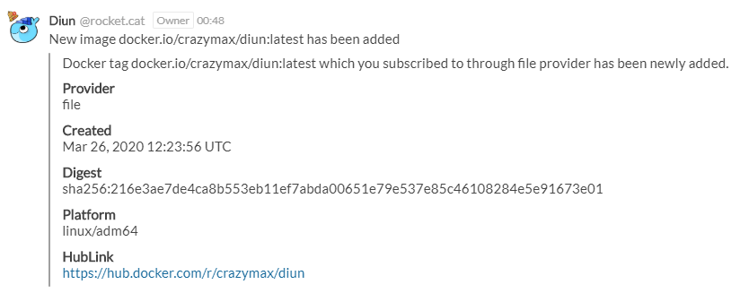
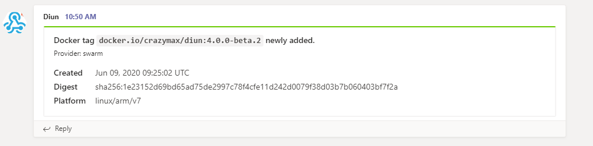

# Notifications

* [Amqp](#amqp)
* [Gotify](#gotify)
* [Mail](#mail)
* [Rocket.Chat](#rocketchat)
* [Script](#script)
* [Slack / Mattermost](#slack--mattermost)
* [Teams](#teams)
* [Telegram](#telegram)
* [Webhook](#webhook)

## Amqp

You can send notifications to any amqp compatible server with the following settings.

### Configuration file

* `amqp`
  * `host`: AMQP server host (default `localhost`). **required**
  * `port`: AMQP server port (default `5672`). **required**
  * `username`: AMQP username.
  * `usernameFile`: Use content of secret file as AMQP username if `username` not defined.
  * `password`: AMQP password.
  * `passwordFile`: Use content of secret file as AMQP password if `password` not defined.
  * `exchange`: Name of the exchange the message will be sent to.
  * `queue`: Name of the queue the message will be sent to. **required**

### Environment variables

* `DIUN_NOTIF_AMQP_HOST`
* `DIUN_NOTIF_AMQP_EXCHANGE`
* `DIUN_NOTIF_AMQP_PORT`
* `DIUN_NOTIF_AMQP_USERNAME`
* `DIUN_NOTIF_AMQP_USERNAMEFILE`
* `DIUN_NOTIF_AMQP_PASSWORD`
* `DIUN_NOTIF_AMQP_PASSWORDFILE`
* `DIUN_NOTIF_AMQP_QUEUE`

### Sample

The JSON response will look like this:

```json
{
  "diun_version": "0.3.0",
  "status": "new",
  "provider": "file",
  "image": "docker.io/crazymax/swarm-cronjob:0.2.1",
  "mime_type": "application/vnd.docker.distribution.manifest.v2+json",
  "digest": "sha256:5913d4b5e8dc15430c2f47f40e43ab2ca7f2b8df5eee5db4d5c42311e08dfb79",
  "created": "2019-01-24T10:26:49.152006005Z",
  "platform": "linux/amd64"
}
```

## Gotify

Notifications can be sent using a [Gotify](https://gotify.net/) instance.

### Configuration file

* `gotify`
  * `endpoint`: Gotify base URL (e.g. `http://gotify.foo.com`). **required**
  * `token`: Application token. **required**
  * `priority`: The priority of the message (default `1`).
  * `timeout`: Timeout specifies a time limit for the request to be made. (default `10s`).

### Environment variables

* `DIUN_NOTIF_GOTIFY_ENDPOINT`
* `DIUN_NOTIF_GOTIFY_TOKEN`
* `DIUN_NOTIF_GOTIFY_PRIORITY`
* `DIUN_NOTIF_GOTIFY_TIMEOUT`

### Sample


## Mail

Notifications can be sent through SMTP.

### Configuration file

* `mail`
  * `host`: SMTP server host. (default `localhost`) **required**
  * `port`: SMTP server port. (default `25`) **required**
  * `ssl`: SSL defines whether an SSL connection is used. Should be false in most cases since the auth mechanism should use STARTTLS. (default `false`)
  * `insecureSkipVerify`: Controls whether a client verifies the server's certificate chain and hostname. (default `false`)
  * `username`: SMTP username.
  * `usernameFile`: Use content of secret file as SMTP username if `username` not defined.
  * `password`: SMTP password.
  * `passwordFile`: Use content of secret file as SMTP password if `password` not defined.
  * `from`: Sender email address. **required**
  * `to`: Recipient email address. **required**

### Environment variables

* `DIUN_NOTIF_MAIL_HOST`
* `DIUN_NOTIF_MAIL_PORT`
* `DIUN_NOTIF_MAIL_SSL`
* `DIUN_NOTIF_MAIL_INSECURESKIPVERIFY`
* `DIUN_NOTIF_MAIL_USERNAME`
* `DIUN_NOTIF_MAIL_USERNAMEFILE`
* `DIUN_NOTIF_MAIL_PASSWORD`
* `DIUN_NOTIF_MAIL_PASSWORDFILE`
* `DIUN_NOTIF_MAIL_FROM`
* `DIUN_NOTIF_MAIL_TO`

### Sample


## Rocket.Chat

Allow to send notifications to your Rocket.Chat channel.

> You must first create a _Personal Access Token_ through your account settings on your RocketChat instance.

### Configuration file

* `rocketchat`
  * `endpoint`: Rocket.Chat base URL (e.g. `http://rocket.foo.com:3000`). **required**
  * `channel`: Channel name with the prefix in front of it. **required**
  * `userID`: User ID. **required**
  * `token`: Authentication token. **required**
  * `timeout`: Timeout specifies a time limit for the request to be made. (default `10s`).

### Environment variables

* `DIUN_NOTIF_ROCKETCHAT_ENDPOINT`
* `DIUN_NOTIF_ROCKETCHAT_CHANNEL`
* `DIUN_NOTIF_ROCKETCHAT_USERID`
* `DIUN_NOTIF_ROCKETCHAT_TOKEN`
* `DIUN_NOTIF_ROCKETCHAT_TIMEOUT`

### Sample



## Script

You can call a script when a notification occured. Following environment variables will be passed:

```
DIUN_VERSION=3.0.0
DIUN_ENTRY_STATUS=new
DIUN_ENTRY_PROVIDER=file
DIUN_ENTRY_IMAGE=docker.io/crazymax/diun:latest
DIUN_ENTRY_MIMETYPE=application/vnd.docker.distribution.manifest.list.v2+json
DIUN_ENTRY_DIGEST=sha256:216e3ae7de4ca8b553eb11ef7abda00651e79e537e85c46108284e5e91673e01
DIUN_ENTRY_CREATED=2020-03-26 12:23:56 +0000 UTC
DIUN_ENTRY_PLATFORM=linux/adm64
```

### Configuration file

* `script`
  * `cmd`: Command or script to execute. **required**
  * `args`: List of args to pass to `cmd`.
  * `dir`: Specifies the working directory of the command.

### Environment variables

* `DIUN_NOTIF_SCRIPT_CMD`
* `DIUN_NOTIF_SCRIPT_ARGS`
* `DIUN_NOTIF_SCRIPT_DIR`

## Slack / Mattermost

You can send notifications to your Slack channel using an [incoming webhook URL](https://api.slack.com/messaging/webhooks).

### Configuration file

* `slack`
  * `webhookURL`: Slack [incoming webhook URL](https://api.slack.com/messaging/webhooks). **required**

### Environment variables

* `DIUN_NOTIF_SLACK_WEBHOOKURL`

### Sample


Mattermost webhooks are compatible with Slack notification without any special configuration (if Webhooks are enabled).

## Teams

You can send notifications to your Teams team-channel using an [incoming webhook URL](https://docs.microsoft.com/en-us/microsoftteams/platform/webhooks-and-connectors/what-are-webhooks-and-connectors).

### Configuration file

* `teams`
  * `webhookURL`: Teams [incoming webhook URL](https://docs.microsoft.com/en-us/microsoftteams/platform/webhooks-and-connectors/what-are-webhooks-and-connectors). **required**

### Environment variables

* `DIUN_NOTIF_TEAMS_WEBHOOKURL`

### Sample



## Telegram

Notifications can be sent via Telegram using a [Telegram Bot](https://core.telegram.org/bots).

Follow the [instructions](https://core.telegram.org/bots#6-botfather) to set up a bot and get it's token.

Message the [GetID bot](https://t.me/getidsbot) to find your chat ID.
Multiple chat IDs can be provided in order to deliver notifications to multiple recipients.

### Configuration file

* `telegram`
  * `token`: Telegram bot token. **required**
  * `chatIDs`: List of chat IDs to send notifications to. **required**

### Environment variables

* `DIUN_NOTIF_TELEGRAM_TOKEN`
* `DIUN_NOTIF_TELEGRAM_CHATIDS` (comma separated)

### Sample


## Webhook

You can send webhook notifications with the following settings.

### Configuration file

* `webhook`
  * `endpoint`: URL of the HTTP request. **required**
  * `method`: HTTP method (default `GET`). **required**
  * `headers`: Map of additional headers to be sent (key is case insensitive).
  * `timeout`: Timeout specifies a time limit for the request to be made. (default `10s`)

### Environment variables

* `DIUN_NOTIF_WEBHOOK_ENDPOINT`
* `DIUN_NOTIF_WEBHOOK_METHOD`
* `DIUN_NOTIF_WEBHOOK_HEADERS_<KEY>`
* `DIUN_NOTIF_WEBHOOK_TIMEOUT`

### Sample

The JSON response will look like this:

```json
{
  "diun_version": "0.3.0",
  "status": "new",
  "provider": "file",
  "image": "docker.io/crazymax/swarm-cronjob:0.2.1",
  "mime_type": "application/vnd.docker.distribution.manifest.v2+json",
  "digest": "sha256:5913d4b5e8dc15430c2f47f40e43ab2ca7f2b8df5eee5db4d5c42311e08dfb79",
  "created": "2019-01-24T10:26:49.152006005Z",
  "platform": "linux/amd64"
}
```
