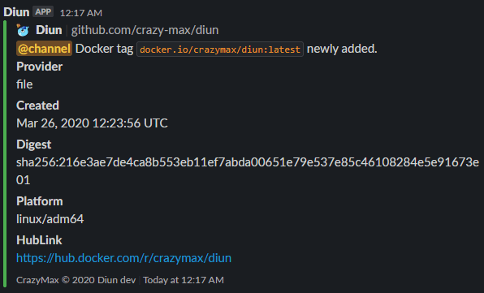

# Notifications

* [Amqp](#amqp)
* [Gotify](#gotify)
* [Mail](#mail)
* [Rocket.Chat](#rocketchat)
* [Slack](#slack)
* [Telegram](#telegram)
* [Webhook](#webhook)

## Amqp

You can send notifications to any amqp compatible server with the following settings:

* `amqp`
  * `host`: AMQP server host (default: `localhost`). **required**
  * `port`: AMQP server port (default: `5672`). **required**
  * `username`: AMQP username. **required**
  * `username_file`: Use content of secret file as AMQP username if `username` not defined.
  * `password`: AMQP password. **required**
  * `password_file`: Use content of secret file as AMQP password if `password` not defined.
  * `exchange`: Name of the exchange the message will be sent to. (default: `empty`)
  * `queue`: Name of the queue the message will be sent to. **required**

The JSON response will look like this:

```json
{
  "diun_version": "0.3.0",
  "status": "new",
  "provider": "file",
  "image": "docker.io/crazymax/swarm-cronjob:0.2.1",
  "mime_type": "application/vnd.docker.distribution.manifest.v2+json",
  "digest": "sha256:5913d4b5e8dc15430c2f47f40e43ab2ca7f2b8df5eee5db4d5c42311e08dfb79",
  "created": "2019-01-24T10:26:49.152006005Z",
  "platform": "linux/amd64"
}
```

## Gotify

Notifications can be sent using a [Gotify](https://gotify.net/) instance:

* `gotify`
  * `endpoint`: Gotify base URL (e.g. `http://gotify.foo.com`). **required**
  * `token`: Application token. **required**
  * `priority`: The priority of the message.
  * `timeout`: Timeout specifies a time limit for the request to be made. (default: `10`).


## Mail

Notifications can be sent through SMTP:

* `mail`
  * `host`: SMTP server host (default: `localhost`). **required**
  * `port`: SMTP server port (default: `25`). **required**
  * `ssl`: SSL defines whether an SSL connection is used. Should be false in most cases since the auth mechanism should use STARTTLS (default: `false`).
  * `insecure_skip_verify`: Controls whether a client verifies the server's certificate chain and hostname (default: `false`).
  * `username`: SMTP username.
  * `username_file`: Use content of secret file as SMTP username if `username` not defined.
  * `password`: SMTP password.
  * `password_file`: Use content of secret file as SMTP password if `password` not defined.
  * `from`: Sender email address. **required**
  * `to`: Recipient email address. **required**


## Rocket.Chat

To be able to send notifications to your Rocket.Chat channel:

> You must first create a _Personal Access Token_ through your account settings on your RocketChat instance.

* `rocketchat`
  * `endpoint`: Rocket.Chat base URL (e.g. `http://rocket.foo.com:3000`). **required**
  * `channel`: Channel name with the prefix in front of it. **required**
  * `user_id`: User ID. **required**
  * `token`: Authentication token. **required**
  * `timeout`: Timeout specifies a time limit for the request to be made. (default: `10`).


## Slack

You can send notifications to your Slack channel using an [incoming webhook URL](https://api.slack.com/messaging/webhooks):

* `slack`
  * `webhook_url`: Slack [incoming webhook URL](https://api.slack.com/messaging/webhooks). **required**



## Teams

You can send notifications to your Teams team-channel using an [incoming webhook URL](https://docs.microsoft.com/en-us/microsoftteams/platform/webhooks-and-connectors/what-are-webhooks-and-connectors):

* `teams`  
  * `webhook_url`: Teams [incoming webhook URL](https://docs.microsoft.com/en-us/microsoftteams/platform/webhooks-and-connectors/what-are-webhooks-and-connectors). **required**


## Telegram

Notifications can be sent via Telegram using a [Telegram Bot](https://core.telegram.org/bots).

Follow the [instructions](https://core.telegram.org/bots#6-botfather) to set up a bot and get it's token.

Message the [GetID bot](https://t.me/getidsbot) to find your chat ID.
Multiple chat IDs can be provided in order to deliver notifications to multiple recipients.

* `telegram`
  * `token`: Telegram bot token. **required**
  * `chat_ids`: List of chat IDs to send notifications to. **required**


## Webhook

You can send webhook notifications with the following settings:

* `webhook`
  * `enable`: Enable webhook notification (default: `false`).
  * `endpoint`: URL of the HTTP request. **required**
  * `method`: HTTP method (default: `GET`). **required**
  * `headers`: Map of additional headers to be sent.
  * `timeout`: Timeout specifies a time limit for the request to be made. (default: `10`).

The JSON response will look like this:

```json
{
  "diun_version": "0.3.0",
  "status": "new",
  "provider": "file",
  "image": "docker.io/crazymax/swarm-cronjob:0.2.1",
  "mime_type": "application/vnd.docker.distribution.manifest.v2+json",
  "digest": "sha256:5913d4b5e8dc15430c2f47f40e43ab2ca7f2b8df5eee5db4d5c42311e08dfb79",
  "created": "2019-01-24T10:26:49.152006005Z",
  "platform": "linux/amd64"
}
```
