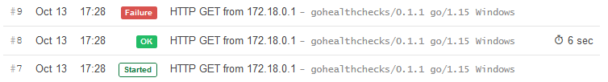

# Watch configuration

## Overview

```yaml
watch:
  workers: 10
  schedule: "0 */6 * * *"
  jitter: 30s
  firstCheckNotif: false
  compareDigest: true
  healthchecks:
    baseURL: https://hc-ping.com/
    uuid: 5bf66975-d4c7-4bf5-bcc8-b8d8a82ea278
```

## Configuration

### `workers`

Maximum number of workers that will execute tasks concurrently. (default `10`)

!!! example "Config file"
    ```yaml
    watch:
      workers: 10
    ```

!!! abstract "Environment variables"
    * `DIUN_WATCH_WORKERS`

### `schedule`

[CRON expression](https://godoc.org/github.com/robfig/cron#hdr-CRON_Expression_Format) to schedule Diun.

!!! warning
    Remove this setting if you want to run Diun directly.

!!! example "Config file"
    ```yaml
    watch:
      schedule: "0 */6 * * *"
    ```

!!! abstract "Environment variables"
    * `DIUN_WATCH_SCHEDULE`

### `jitter`

Enable time jitter. Prior to executing of a job, cron will sleep a random
duration in the range from 0 to _jitter_. (default `30s`)

!!! note
    Only works with `schedule` setting. `0` disables time jitter.

!!! example "Config file"
    ```yaml
    watch:
      schedule: "0 */6 * * *"
      jitter: 30s
    ```

!!! abstract "Environment variables"
    * `DIUN_WATCH_JITTER`

### `firstCheckNotif`

Send notification at the very first analysis of an image. (default `false`)

!!! example "Config file"
    ```yaml
    watch:
      firstCheckNotif: false
    ```

!!! abstract "Environment variables"
    * `DIUN_WATCH_FIRSTCHECKNOTIF`

### `compareDigest`

Compare the digest of an image with the registry before downloading the image manifest. It is strongly
recommended leaving this value at `true`, especially with [Docker Hub which imposes a rate-limit](../faq.md#docker-hub-rate-limits)
on image pull. (default `true`)

!!! example "Config file"
    ```yaml
    watch:
      compareDigest: true
    ```

!!! abstract "Environment variables"
    * `DIUN_WATCH_COMPAREDIGEST`

### `healthchecks`

Healthchecks allows monitoring Diun watcher by sending start and success notification
events to [healthchecks.io](https://healthchecks.io/).

!!! tip
    A [Docker image for Healthchecks](https://github.com/crazy-max/docker-healthchecks) is available if you want
    to self-host your instance.



!!! example "Config file"
    ```yaml
    watch:
      healthchecks:
        baseURL: https://hc-ping.com/
        uuid: 5bf66975-d4c7-4bf5-bcc8-b8d8a82ea278
    ```

!!! abstract "Environment variables"
    * `DIUN_WATCH_HEALTHCHECKS_BASEURL`
    * `DIUN_WATCH_HEALTHCHECKS_UUID`

* `baseURL`: Base URL for the Healthchecks Ping API (default `https://hc-ping.com/`).
* `uuid`: UUID of an existing healthcheck (required).
