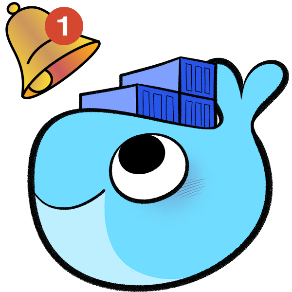

  
  
  
  
  
   
  
  
  

---

## What is Diun?

**D**ocker **I**mage **U**pdate **N**otifier helps you keep track of container
image updates without manually watching registries.

Diun checks your images on a schedule, detects when a tracked tag or digest has
changed, and notifies you when something new is available. That makes it useful
for staying on top of upstream base image rebuilds, application releases, and
other image changes that can otherwise slip by unnoticed.

You can run Diun as a [single executable](https://github.com/crazy-max/diun/releases/latest)
or as a [Docker image](install/docker.md), point it at the container sources you
care about, and send notifications to the messaging services your team already
uses.

## Features

* Watch container images and report when tags or digests change
* Track repositories with include and exclude filters for tags
* Run checks on a schedule without needing an external cron job
* Discover images from [Docker](providers/docker.md), [Containerd](providers/containerd.md),
  [Kubernetes](providers/kubernetes.md), [Swarm](providers/swarm.md), [Nomad](providers/nomad.md),
  [Dockerfile](providers/dockerfile.md), and [File](providers/file.md) providers
* Override target image OS and architecture when needed
* Send notifications through Gotify, Mail, Slack, Telegram, and [more](config/index.md#reference)
* Integrate with [Healthchecks](config/watch.md#healthchecks) to monitor the watcher itself
* Use detailed logging to understand checks, updates, and delivery status
* Run as a [single binary](https://github.com/crazy-max/diun/releases/latest) or with the official
  [Docker image](install/docker.md)

## License

This project is licensed under the terms of the MIT license.
