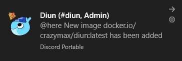
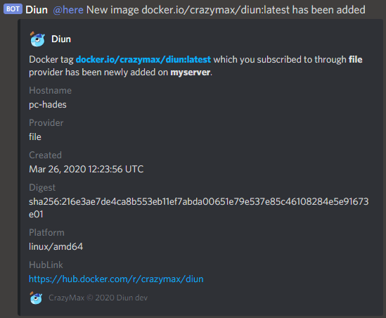

# Discord notifications

Allow to send notifications to your Discord channel.

## Configuration

!!! example "File"
    ```yaml
    notif:
      discord:
        webhookURL: https://discordapp.com/api/webhooks/1234567890/Abcd-eFgh-iJklmNo_pqr
        mentions:
          - "@here"
          - "@everyone"
          - "<@124>"
          - "<@125>"
          - "<@&200>"
        timeout: 10s
    ```

!!! abstract "Environment variables"
    * `DIUN_NOTIF_DISCORD_WEBHOOK`
    * `DIUN_NOTIF_DISCORD_MENTIONS`
    * `DIUN_NOTIF_DISCORD_TIMEOUT`

| Name               | Default       | Description   |
|--------------------|---------------|---------------|
| `webhookURL`[^1]   |               | Discord [incoming webhook URL](https://support.discord.com/hc/en-us/articles/228383668-Intro-to-Webhooks) |
| `mentions`          |              | List of users or roles to notify |
| `timeout`          | `10s`         | Timeout specifies a time limit for the request to be made |

## Sample





[^1]: Value required
