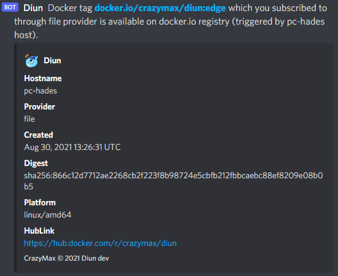

# Discord notifications

Allow sending notifications to your Discord channel.

## Configuration

!!! example "File"
    ```yaml
    notif:
      discord:
        webhookURL: https://discordapp.com/api/webhooks/1234567890/Abcd-eFgh-iJklmNo_pqr
        mentions:
          - "@here"
          - "@everyone"
          - "<@124>"
          - "<@125>"
          - "<@&200>"
        renderFields: true
        timeout: 10s
        templateBody: |
          Docker tag {{ .Entry.Image }} which you subscribed to through {{ .Entry.Provider }} provider has been released.
    ```

| Name               | Default                            | Description                                                                                               |
| ------------------ | ---------------------------------- | --------------------------------------------------------------------------------------------------------- |
| `webhookURL`       |                                    | Discord [incoming webhook URL](https://support.discord.com/hc/en-us/articles/228383668-Intro-to-Webhooks) |
| `webhookURLFile`   |                                    | Use content of secret file as webhook URL if `webhookURL` is not defined                                  |
| `mentions`         |                                    | List of users or roles to notify                                                                          |
| `renderFields`     | `true`                             | Render embed and [field objects](https://discordjs.guide/popular-topics/embeds.html)                      |
| `timeout`          | `10s`                              | Timeout specifies a time limit for the request to be made                                                 |
| `templateBody`[^1] | See [below](#default-templatebody) | [Notification template](../faq.md#notification-template) for message body                                 |

!!! abstract "Environment variables"
    * `DIUN_NOTIF_DISCORD_WEBHOOKURL`
    * `DIUN_NOTIF_DISCORD_WEBHOOKURLFILE`
    * `DIUN_NOTIF_DISCORD_MENTIONS` (comma separated)
    * `DIUN_NOTIF_DISCORD_RENDERFIELDS`
    * `DIUN_NOTIF_DISCORD_TIMEOUT`
    * `DIUN_NOTIF_DISCORD_TEMPLATEBODY`

### Default `templateBody`

```
[[ config.extra.template.notif.defaultBody ]]
```

## Sample




[^1]: Value required
