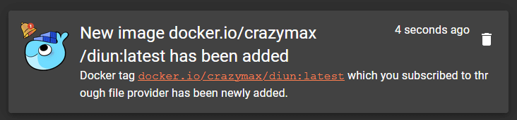

# Gotify notifications

Notifications can be sent using a [Gotify](https://gotify.net/) instance.

## Configuration

!!! example "File"
    ```yaml
    notif:
      gotify:
        endpoint: http://gotify.foo.com
        token: Token123456
        priority: 1
        timeout: 10s
        templateTitle: "{{ .Entry.Image }} released"
        templateBody: |
          Docker tag {{ .Entry.Image }} which you subscribed to through {{ .Entry.Provider }} provider has been released.
    ```

| Name                | Default                               | Description   |
|---------------------|---------------------------------------|---------------|
| `endpoint`[^1]      |                                       | Gotify base URL |
| `token`             |                                       | Application token |
| `tokenFile`         |                                       | Use content of secret file as application token if `token` not defined |
| `priority`          | `1`                                   | The priority of the message |
| `timeout`           | `10s`                                 | Timeout specifies a time limit for the request to be made |
| `templateTitle`[^1] | See [below](#default-templatetitle)   | [Notification template](../faq.md#notification-template) for message title |
| `templateBody`[^1]  | See [below](#default-templatebody)    | [Notification template](../faq.md#notification-template) for message body |

!!! abstract "Environment variables"
    * `DIUN_NOTIF_GOTIFY_ENDPOINT`
    * `DIUN_NOTIF_GOTIFY_TOKEN`
    * `DIUN_NOTIF_GOTIFY_TOKENFILE`
    * `DIUN_NOTIF_GOTIFY_PRIORITY`
    * `DIUN_NOTIF_GOTIFY_TIMEOUT`
    * `DIUN_NOTIF_GOTIFY_TEMPLATETITLE`
    * `DIUN_NOTIF_GOTIFY_TEMPLATEBODY`

### Default `templateTitle`

```
[[ config.extra.template.defaultTitle ]]
```

### Default `templateBody`

```
[[ config.extra.template.defaultBody ]]
```

## Sample



[^1]: Value required
