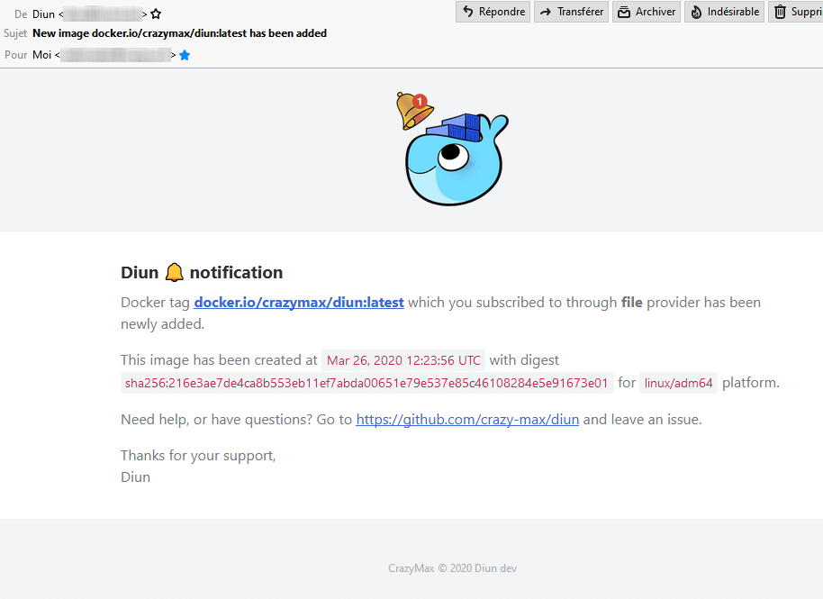

# Mail notifications

Notifications can be sent through SMTP.

## Configuration

!!! example "File"
    ```yaml
    notif:
      mail:
        host: localhost
        port: 25
        ssl: false
        insecureSkipVerify: false
        from: diun@example.com
        to:
          - webmaster@example.com
          - me@example.com
        templateTitle: "{{ .Entry.Image }} released"
        templateBody: |
          Docker tag {{ .Entry.Image }} which you subscribed to through {{ .Entry.Provider }} provider has been released.
    ```

| Name                  | Default                                    | Description   |
|-----------------------|--------------------------------------------|---------------|
| `host`[^1]            | `localhost`                                | SMTP server host |
| `port`[^1]            | `25`                                       | SMTP server port |
| `ssl`                 | `false`                                    | SSL defines whether an SSL connection is used. Should be false in most cases since the auth mechanism should use STARTTLS |
| `insecureSkipVerify`  | `false`                                    | Controls whether a client verifies the server's certificate chain and hostname |
| `localName`           | `localhost`                                | Hostname sent to the SMTP server with the HELO command |
| `username`            |                                            | SMTP username |
| `usernameFile`        |                                            | Use content of secret file as SMTP username if `username` not defined |
| `password`            |                                            | SMTP password |
| `passwordFile`        |                                            | Use content of secret file as SMTP password if `password` not defined |
| `from`[^1]            |                                            | Sender email address |
| `to`[^1]              |                                            | List of recipients email addresses |
| `templateTitle`[^1]   | See [below](#default-templatetitle)        | [Notification template](../faq.md#notification-template) for message title |
| `templateBody`[^1]    | See [below](#default-templatebody)         | [Notification template](../faq.md#notification-template) for message body |

!!! abstract "Environment variables"
    * `DIUN_NOTIF_MAIL_HOST`
    * `DIUN_NOTIF_MAIL_PORT`
    * `DIUN_NOTIF_MAIL_SSL`
    * `DIUN_NOTIF_MAIL_INSECURESKIPVERIFY`
    * `DIUN_NOTIF_MAIL_LOCALNAME`
    * `DIUN_NOTIF_MAIL_USERNAME`
    * `DIUN_NOTIF_MAIL_USERNAMEFILE`
    * `DIUN_NOTIF_MAIL_PASSWORD`
    * `DIUN_NOTIF_MAIL_PASSWORDFILE`
    * `DIUN_NOTIF_MAIL_FROM`
    * `DIUN_NOTIF_MAIL_TO` (comma separated)
    * `DIUN_NOTIF_MAIL_TEMPLATETITLE`
    * `DIUN_NOTIF_MAIL_TEMPLATEBODY`

### Default `templateTitle`

```
[[ config.extra.template.notif.defaultTitle ]]
```

### Default `templateBody`

```
Docker tag {{ if .Entry.Image.HubLink }}[**{{ .Entry.Image }}**]({{ .Entry.Image.HubLink }}){{ else }}**{{ .Entry.Image }}**{{ end }}
which you subscribed to through {{ .Entry.Provider }} provider {{ if (eq .Entry.Status "new") }}is available{{ else }}has been updated{{ end }}
on **{{ .Entry.Image.Domain }}** registry (triggered by _{{ escapeMarkdown .Meta.Hostname }}_ host).

This image has been {{ if (eq .Entry.Status "new") }}created{{ else }}updated{{ end }} at
<code>{{ .Entry.Manifest.Created.Format "Jan 02, 2006 15:04:05 UTC" }}</code> with digest <code>{{ .Entry.Manifest.Digest }}</code>
for <code>{{ .Entry.Manifest.Platform }}</code> platform.

Need help, or have questions? Go to {{ .Meta.URL }} and leave an issue.
```

!!! note
    `escapeMarkdown` is a special function to deal with a [markdown strict parsing issue](https://github.com/crazy-max/diun/issues/656#issuecomment-1192886488) with the template engine.

## Sample



[^1]: Value required
