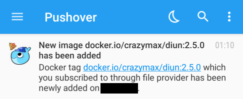

# Pushover notifications

You can send notifications using [Pushover](https://pushover.net/).

## Configuration

!!! example "File"
    ```yaml
    notif:
      pushover:
        token: uQiRzpo4DXghDmr9QzzfQu27cmVRsG
        recipient: gznej3rKEVAvPUxu9vvNnqpmZpokzF
        priority: -2
        sound: none
        templateTitle: "{{ .Entry.Image }} released"
        templateBody: |
          Docker tag {{ .Entry.Image }} which you subscribed to through {{ .Entry.Provider }} provider has been released.
        templateURLTitle: "{{ if .Entry.Image.HubLink }}{{ .Entry.Image }}{{ end }}"
        templateURL: "{{ if .Entry.Image.HubLink }}{{ .Entry.Image.HubLink }}{{ end }}"
    ```

| Name                   | Default                             | Description                                                                         |
|------------------------|-------------------------------------|-------------------------------------------------------------------------------------|
| `token`                |                                     | Pushover [application/API token](https://pushover.net/api#registration)             |
| `tokenFile`            |                                     | Use content of secret file as Pushover application/API token if `token` not defined |
| `recipient`            |                                     | User key to send notification to                                                    |
| `recipientFile`        |                                     | Use content of secret file as User key if `recipient` not defined                   |
| `priority`             |                                     | Priority of the notification                                                        |
| `sound`                |                                     | Notification sound to be used                                                       |
| `templateTitle`[^1]    | See [below](#default-templatetitle) | [Notification template](../faq.md#notification-template) for message title          |
| `templateBody`[^1]     | See [below](#default-templatebody)  | [Notification template](../faq.md#notification-template) for message body           |
| `templateURLTitle`[^1] | See [below](#default-templatetitle) | [Notification template](../faq.md#notification-template) for URL title              |
| `templateURL`[^1]      | See [below](#default-templatebody)  | [Notification template](../faq.md#notification-template) for URL                    |

!!! abstract "Environment variables"
    * `DIUN_NOTIF_PUSHOVER_TOKEN`
    * `DIUN_NOTIF_PUSHOVER_TOKENFILE`
    * `DIUN_NOTIF_PUSHOVER_RECIPIENT`
    * `DIUN_NOTIF_PUSHOVER_RECIPIENTFILE`
    * `DIUN_NOTIF_PUSHOVER_PRIORITY`
    * `DIUN_NOTIF_PUSHOVER_SOUND`
    * `DIUN_NOTIF_PUSHOVER_TEMPLATETITLE`
    * `DIUN_NOTIF_PUSHOVER_TEMPLATEBODY`
    * `DIUN_NOTIF_PUSHOVER_TEMPLATEURLTITLE`
    * `DIUN_NOTIF_PUSHOVER_TEMPLATEURL`

### Default `templateTitle`

```
[[ config.extra.template.notif.defaultTitle ]]
```

### Default `templateBody`

```
[[ config.extra.template.notif.defaultBody ]]
```
### Default `templateURLTitle`

```
[[ config.extra.template.notif.defaultURLTitle ]]
```

### Default `templateURL`

```
[[ config.extra.template.notif.defaultURL ]]
```

## Sample



[^1]: Value required
