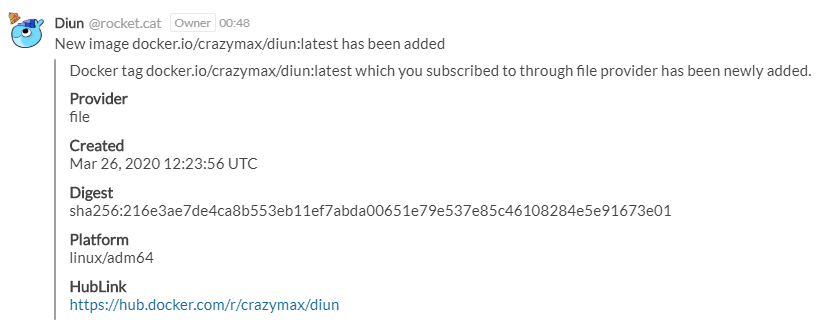

# Rocket.Chat notifications

Allow sending notifications to your Rocket.Chat channel.

## Configuration

!!! example "File"
    ```yaml
    notif:
      rocketchat:
        endpoint: http://rocket.foo.com:3000
        channel: "#general"
        userID: abcdEFGH012345678
        token: Token123456
        renderAttachment: true
        timeout: 10s
        templateTitle: "{{ .Entry.Image }} released"
        templateBody: |
          Docker tag {{ .Entry.Image }} which you subscribed to through {{ .Entry.Provider }} provider has been released.
    ```

| Name                | Default                                    | Description   |
|---------------------|--------------------------------------------|---------------|
| `endpoint`[^1]      |                                            | Rocket.Chat base URL |
| `channel`[^1]       |                                            | Channel name with the prefix in front of it |
| `userID`[^1]        |                                            | User ID |
| `token`             |                                            | Authentication token |
| `tokenFile`         |                                            | Use content of secret file as authentication token if `token` not defined |
| `renderAttachment`  | `true`                                     | Render [attachment object](https://docs.rocket.chat/guides/user-guides/messaging#send-attachments) |
| `timeout`           | `10s`                                      | Timeout specifies a time limit for the request to be made |
| `templateTitle`[^1] | See [below](#default-templatetitle)        | [Notification template](../faq.md#notification-template) for message title |
| `templateBody`[^1]  | See [below](#default-templatebody)         | [Notification template](../faq.md#notification-template) for message body |

!!! warning
    You must first create a _Personal Access Token_ through your account settings on your Rocket.Chat instance.

!!! abstract "Environment variables"
    * `DIUN_NOTIF_ROCKETCHAT_ENDPOINT`
    * `DIUN_NOTIF_ROCKETCHAT_CHANNEL`
    * `DIUN_NOTIF_ROCKETCHAT_USERID`
    * `DIUN_NOTIF_ROCKETCHAT_TOKEN`
    * `DIUN_NOTIF_ROCKETCHAT_TOKENFILE`
    * `DIUN_NOTIF_ROCKETCHAT_RENDERATTACHMENT`
    * `DIUN_NOTIF_ROCKETCHAT_TIMEOUT`
    * `DIUN_NOTIF_ROCKETCHAT_TEMPLATETITLE`
    * `DIUN_NOTIF_ROCKETCHAT_TEMPLATEBODY`

### Default `templateTitle`

```
[[ config.extra.template.notif.defaultTitle ]]
```

### Default `templateBody`

```
Docker tag {{ .Entry.Image }} which you subscribed to through {{ .Entry.Provider }} provider has been {{ if (eq .Entry.Status "new") }}newly added{{ else }}updated{{ end }} on {{ .Meta.Hostname }}.
```

## Sample



[^1]: Value required
