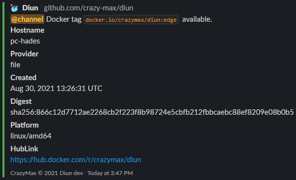

# Slack notifications

You can send notifications to your Slack channel using an [incoming webhook URL](https://api.slack.com/messaging/webhooks).

!!! hint
    Mattermost webhooks are compatible with Slack notification without any special configuration (if Webhooks are enabled).

## Configuration

!!! example "File"
    ```yaml
    notif:
      slack:
        webhookURL: https://hooks.slack.com/services/ABCD12EFG/HIJK34LMN/01234567890abcdefghij
        templateBody: |
          Docker tag {{ .Entry.Image }} which you subscribed to through {{ .Entry.Provider }} provider has been released.
    ```

| Name               | Default                                    | Description   |
|--------------------|--------------------------------------------|---------------|
| `webhookURL`[^1]   |                                            | Slack [incoming webhook URL](https://api.slack.com/messaging/webhooks) |
| `templateBody`[^1] | See [below](#default-templatebody)         | [Notification template](../faq.md#notification-template) for message body |

!!! abstract "Environment variables"
    * `DIUN_NOTIF_SLACK_WEBHOOKURL`
    * `DIUN_NOTIF_SLACK_TEMPLATEBODY`

### Default `templateBody`

```
<!channel> Docker tag `{{ .Entry.Image }}` {{ if (eq .Entry.Status "new") }}newly added{{ else }}updated{{ end }}.
```

## Sample



[^1]: Value required
