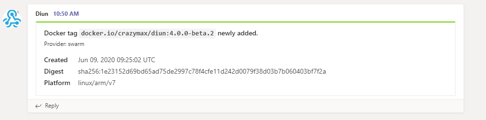

# Teams notifications

You can send notifications to your Teams team-channel using an [incoming webhook URL](https://docs.microsoft.com/en-us/microsoftteams/platform/webhooks-and-connectors/what-are-webhooks-and-connectors).

## Configuration

!!! example "File"
    ```yaml
    notif:
      teams:
        webhookURL: https://outlook.office.com/webhook/ABCD12EFG/HIJK34LMN/01234567890abcdefghij
    ```

| Name               | Default       | Description   |
|--------------------|---------------|---------------|
| `webhookURL`[^1]   |               | Teams [incoming webhook URL](https://docs.microsoft.com/en-us/microsoftteams/platform/webhooks-and-connectors/what-are-webhooks-and-connectors) |

!!! abstract "Environment variables"
    * `DIUN_NOTIF_TEAMS_WEBHOOKURL`

## Sample



[^1]: Value required
