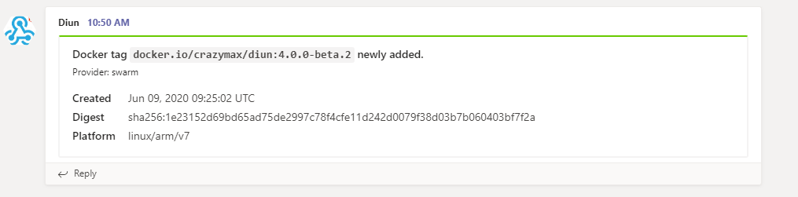

# Teams notifications

You can send notifications to your Teams team-channel using an [incoming webhook URL](https://docs.microsoft.com/en-us/microsoftteams/platform/webhooks-and-connectors/what-are-webhooks-and-connectors) or a Microsoft Teams Workflows webhook URL.

## Configuration

!!! example "File"
    ```yaml
    notif:
      teams:
        webhookURL: https://outlook.office.com/webhook/ABCD12EFG/HIJK34LMN/01234567890abcdefghij
        cardType: messageCard
        renderFacts: true
        templateBody: |
          Docker tag {{ .Entry.Image }} which you subscribed to through {{ .Entry.Provider }} provider has been released.
    ```

| Name               | Default                            | Description                                                                                                                                     |
|--------------------|------------------------------------|-------------------------------------------------------------------------------------------------------------------------------------------------|
| `webhookURL`       |                                    | Teams [incoming webhook URL](https://docs.microsoft.com/en-us/microsoftteams/platform/webhooks-and-connectors/what-are-webhooks-and-connectors) or Workflows webhook URL              |
| `webhookURLFile`   |                                    | Use content of [secret file](../faq.md#secrets-loaded-from-files-and-trailing-newlines) as webhook URL if `webhookURL` is not defined           |
| `cardType`         | `messageCard`                      | Card payload type. Can be `messageCard` or `adaptiveCard`. Use `adaptiveCard` for Teams Workflows webhooks                                    |
| `renderFacts`      | `true`                             | Render fact objects                                                                                                                             |
| `timeout`          | `10s`                              | Timeout specifies a time limit for the request to be made                                                                                       |
| `proxy`            |                                    | HTTP proxy URL to use for requests                                                                                                              |
| `tlsSkipVerify`    | `false`                            | Skip TLS certificate verification                                                                                                               |
| `tlsCaCertFiles`   |                                    | List of paths to custom CA certificate files to use for TLS verification                                                                        |
| `templateBody`[^1] | See [below](#default-templatebody) | [Notification template](../faq.md#notification-template) for message body                                                                       |

!!! abstract "Environment variables"
    * `DIUN_NOTIF_TEAMS_WEBHOOKURL`
    * `DIUN_NOTIF_TEAMS_WEBHOOKURLFILE`
    * `DIUN_NOTIF_TEAMS_CARDTYPE`
    * `DIUN_NOTIF_TEAMS_RENDERFACTS`
    * `DIUN_NOTIF_TEAMS_TIMEOUT`
    * `DIUN_NOTIF_TEAMS_PROXY`
    * `DIUN_NOTIF_TEAMS_TLSSKIPVERIFY`
    * `DIUN_NOTIF_TEAMS_TLSCACERTFILES`
    * `DIUN_NOTIF_TEAMS_TEMPLATEBODY`

### Default `templateBody`

```
Docker tag {{ if .Entry.Image.HubLink }}[`{{ .Entry.Image }}`]({{ .Entry.Image.HubLink }}){{ else }}`{{ .Entry.Image }}`{{ end }} {{ if (eq .Entry.Status "new") }}available{{ else }}updated{{ end }}.
```

### Microsoft Teams Workflows

Microsoft Teams Workflows webhooks can receive Adaptive Card payloads. To use a workflow URL created from the Teams Workflows app, set:

```yaml
notif:
  teams:
    webhookURL: https://prod-00.westeurope.logic.azure.com/workflows/...
    cardType: adaptiveCard
```

## Sample



[^1]: Value required
