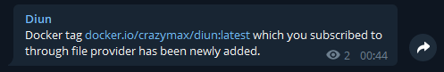

# Telegram notifications

Notifications can be sent via Telegram using a [Telegram Bot](https://core.telegram.org/bots).

Follow the [instructions](https://core.telegram.org/bots#6-botfather) to set up a bot and get it's token.

Message the [GetID bot](https://t.me/getidsbot) to find your chat ID.
Multiple chat IDs can be provided in order to deliver notifications to multiple recipients.

## Configuration

!!! example "File"
    ```yaml
    notif:
      telegram:
        token: aabbccdd:11223344
        chatIDs:
          - 123456789
          - 987654321
        templateBody: |
          Docker tag {{ .Entry.Image }} which you subscribed to through {{ .Entry.Provider }} provider has been released.
    ```

| Name               | Default                                    | Description   |
|--------------------|--------------------------------------------|---------------|
| `token`            |                                            | Telegram bot token |
| `tokenFile`        |                                            | Use content of secret file as Telegram bot token if `token` not defined |
| `chatIDs`          |                                            | List of chat IDs to send notifications to |
| `chatIDsFile`      |                                            | Use content of secret file as chat IDs if `chatIDs` not defined |
| `templateBody`[^1] | See [below](#default-templatebody)         | [Notification template](../faq.md#notification-template) for message body |

!!! abstract "Environment variables"
    * `DIUN_NOTIF_TELEGRAM_TOKEN`
    * `DIUN_NOTIF_TELEGRAM_TOKENFILE`
    * `DIUN_NOTIF_TELEGRAM_CHATIDS` (comma separated)
    * `DIUN_NOTIF_TELEGRAM_CHATIDSFILE`
    * `DIUN_NOTIF_TELEGRAM_TEMPLATEBODY`

!!! example "chat IDs secret file"
    Chat IDs secret file must be a valid JSON array like: `[123456789,987654321]`

### Default `templateBody`

```
Docker tag {{ if .Entry.Image.HubLink }}[{{ .Entry.Image }}]({{ .Entry.Image.HubLink }}){{ else }}{{ .Entry.Image }}{{ end }} which you subscribed to through {{ .Entry.Provider }} provider has been {{ if (eq .Entry.Status "new") }}newly added{{ else }}updated{{ end }} on {{ escapeMarkdown .Meta.Hostname }}.
```

!!! note
    `escapeMarkdown` is a special function to deal with a [markdown strict parsing issue](https://github.com/crazy-max/diun/issues/162#issuecomment-683095898) on Telegram server.

## Sample



[^1]: Value required
